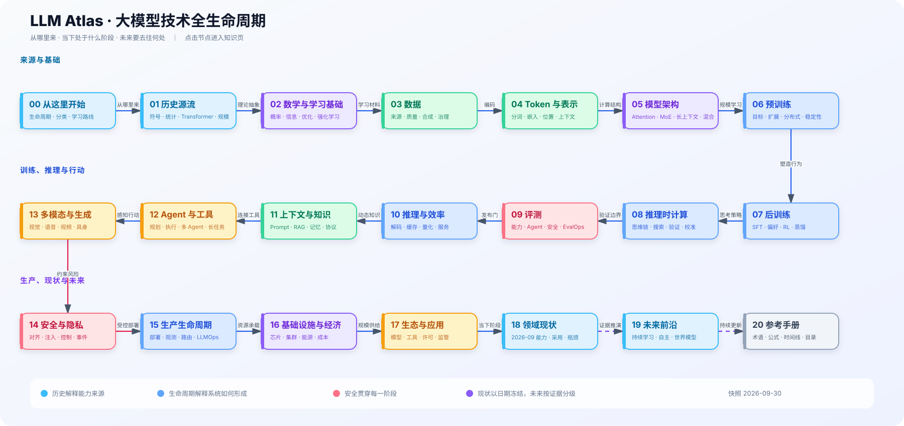

# LLM Atlas v2 · 大模型技术全景与工程路线

> 面向资深前后端研发与技术专家：从大模型为何出现，到如何训练、评测、部署和持续演进，再到下一阶段可能去往何处。

[打开交互知识地图](./LLM-ATLAS.html) · [进入知识树](./knowledge/00-navigation/README.md) · [开始可运行实践](./labs/README.md) · [阅读 PDF 小书](./output/pdf/LLM-Atlas.pdf)



## 这不是模型名词表

LLM Atlas 把大模型视为一套有目标、有资源约束、有反馈且必须承担失败后果的系统。完整链路是：

> 能力契约 → 数据与治理 → Tokenizer 与架构 → 训练系统 → 预训练 → Mid-training → 后训练 → 推理强化 → 评测与安全门 → 压缩与服务 → 生产反馈 → 更新或退役

知识库围绕五个工程问题组织：

1. **生命周期**：技术从何而来，当前处于生成器向推理/行动系统过渡的什么位置，未来有哪些可证伪情景。
2. **圣杯**：学术界追求泛化、持续学习、自我改进和可控性；产业界追求单位成本智能、可靠自治、数据飞轮和平台生态。
3. **技术路线**：比较稠密 Decoder、稀疏 MoE、推理优先、长上下文/RAG/记忆、多模态、Agentic System 和小模型路线。
4. **技术实践**：用 `Atlas-125M` 理解从零训练，用 `Qwen3-0.6B-Base` 跑通持续预训练、SFT、DPO、可验证 RL、自进化、量化和服务。
5. **职业迁移**：把前端的交互与状态、后端的分布式与可靠性、平台工程的数据与调度能力映射到大模型岗位。

## 最短阅读路径

- **30 分钟建立全景**：[完整生命周期](./knowledge/00-navigation/complete-lifecycle.md) → [圣杯矩阵](./knowledge/02-grails/grail-maturity-matrix.md) → [技术流派比较](./knowledge/03-mature-technology-schools/comparison-matrix.md)。
- **准备训练模型**：[Top 模型生命周期](./knowledge/04-top-model-lifecycle/README.md) → [预训练运行手册](./knowledge/04-top-model-lifecycle/05-pretraining/pretraining-runbook.md) → [发布门禁](./knowledge/04-top-model-lifecycle/12-release-and-evolution/model-cards-and-release-gates.md)。
- **开始动手**：[实践说明](./knowledge/06-hands-on-practice/README.md) → [实验环境](./knowledge/06-hands-on-practice/00-environment-and-baseline.md) → [自进化闭环](./knowledge/06-hands-on-practice/09-self-evolution-loop.md)。
- **从研发转型**：[能力矩阵](./knowledge/10-career/competency-matrix.md) → [30 天路线](./knowledge/10-career/30-day-fast-track.md) → [12 周路线](./knowledge/10-career/12-week-core-path.md)。

## 内容可信度

- 稳定机制与时效快照分离；现状集中在 [`2026-10`](./knowledge/08-state-of-the-field/2026-10/maturity-scoreboard.md)。
- 每篇文章包含核验日期和证据等级；关键结论登记在 [`claim-register.yml`](./evidence/claim-register.yml)。
- 优先引用论文、模型技术报告、官方文档、标准与可复现实验；不把厂商未披露细节写成事实。
- “自进化”特指生成、验证、课程、训练、独立评测组成的受控闭环，不等同于通用智能或无限递归改进。

## 仓库结构

| 目录 | 用途 |
|---|---|
| `knowledge/` | 12 个知识域、完整生命周期和角色化路线 |
| `labs/` | 原生 PyTorch 教学内核、成熟框架配置与可验证自进化实验 |
| `catalogs/` | 模型、数据集、基准、框架、硬件和论文的结构化索引 |
| `evidence/` | 来源政策、证据等级、参考文献和关键结论登记 |
| `atlas/` | Archify typed JSON 与验收证据 |
| `book/` | 120–160 页 PDF 小书的章节源、图和样式 |
| `scripts/` | 内容、链接、实验、地图和 PDF 的构建与验证 |

## 本地验证

```bash
make validate
make lab-smoke
```

地图和小书的生成依赖说明分别见 [`atlas/README.md`](./atlas/README.md) 与 [`book/README.md`](./book/README.md)。贡献前请阅读 [CONTRIBUTING](./CONTRIBUTING.md)。
